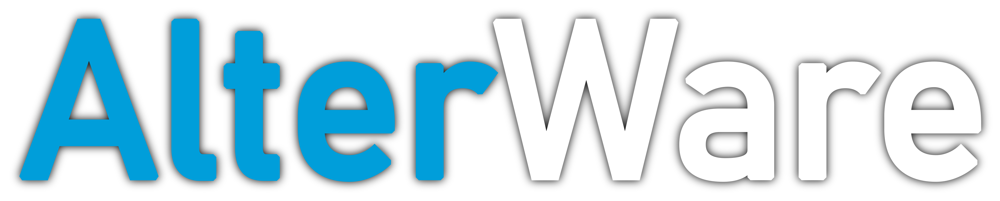

<div align="center">

# AlterWare Launcher

#### Official launcher for AlterWare Call of Duty mods

##### IW4x | IW4-SP | IW5-Mod | IW6-Mod | S1-Mod

  
</div>

> [!IMPORTANT]
> **Only legitimate copies of the games are supported. If you don't own the game, please buy it.**

## 🗺️ Table of Contents

<a href="https://alterware.dev"></a>

- [Installation](#-installation)
- [Supported Games](#-supported-games)
- [Command line arguments](#%EF%B8%8F-command-line-arguments)
- [Config file](#-config-file-alterware-launcherjson)
- [Building from Source](#-building-from-source)
- [Support](#-support)

---

## 📦 Installation
[**Windows**](#-windows) | [**Debian/Ubuntu**](#-debianubuntu-amd64arm64) | [**Other Linux OS**](#-other-linux-os) | [**macOS**](#-macos)

---

### 🪟 Windows
1. Download the game from [Steam](https://store.steampowered.com/).
2. Download the appropriate version of the AlterWare launcher:
   - **Windows 64-bit**: Download the [latest alterware-launcher.exe](https://github.com/mxve/alterware-launcher/releases/latest/download/alterware-launcher.exe).
   - **Windows 32-bit**: Download the [latest alterware-launcher-x86.exe](https://github.com/mxve/alterware-launcher/releases/latest/download/alterware-launcher-x86.exe).
3. Place the `alterware-launcher.exe` in the game directory.
4. Run `alterware-launcher.exe`. After updating, the game will launch automatically.

> [!NOTE]
> Windows 7 is no longer supported. [v0.6.12](https://github.com/mxve/alterware-launcher/releases/tag/v0.6.12) is the last version that will run on Windows 7.
> To keep using it, set `"skip_self_update": true` in the `alterware-launcher.json` config file.

> [!IMPORTANT]
> ### Information for server owners:
> On Windows, the launcher self-updates and restarts by spawning a new console.
> For automated processes, use `--skip-launcher-update` and manually download the latest launcher from [here](https://github.com/mxve/alterware-launcher/releases/latest/download/alterware-launcher.exe).

---

### 🐧 Debian/Ubuntu (amd64/arm64)

1. Download the game from Steam using either [SteamCMD](https://developer.valvesoftware.com/wiki/SteamCMD) or the official Steam desktop app.
2. Follow the instructions provided in [this forum post](https://forum.alterware.dev/t/linux-debian-ubuntu-amd64-arm64-install-the-alterware-launcher-using-our-apt-repository/1117) to install the alterware-launcher using our self-hosted APT repository.
3. Once installed, run the launcher from your game directory to download the client files automatically.

> [!TIP]
> Use the `--update` command-line argument if you want to launch the game through Proton or other Wine versions instead of the default wine found in your path.

> [!NOTE]
> The steps above can be used for any Debian-based distribution that uses the APT package manager.

> [!NOTE]
> For more information on how to run the launcher on Linux, see [this guide](https://forum.alterware.dev/t/all-clients-useful-info-for-running-our-mods-under-linux/343).

---

### 🐧 Other Linux OS

1. Download the game from Steam using either [SteamCMD](https://developer.valvesoftware.com/wiki/SteamCMD) or the official Steam desktop app.
2. Download the [latest release](https://github.com/mxve/alterware-launcher/releases/latest) corresponding to your system architecture.
    - Most likely you want [alterware-launcher-x86_64-unknown-linux-gnu.tar.gz](https://github.com/mxve/alterware-launcher/releases/latest/download/alterware-launcher-x86_64-unknown-linux-gnu.tar.gz)
3. Unpack the archive and copy the `alterware-launcher` executable to your game directory.
    - Alternatively, you can place it in your `PATH` so you can run it from anywhere. For example, in `/usr/local/bin/`
4. Make the launcher executable: `chmod +x alterware-launcher`
5. Run the launcher from your game directory to download the client files: `./alterware-launcher`

> [!TIP]
> Use the `--update` command-line argument if you want to launch the game through Proton or other Wine versions instead of the default wine found in your path.

> [!NOTE]
> For more information on how to run the launcher on Linux, see [this guide](https://forum.alterware.dev/t/all-clients-useful-info-for-running-our-mods-under-linux/343).

---

### 🍎 macOS

1. Download the game from Steam using either [SteamCMD](https://developer.valvesoftware.com/wiki/SteamCMD) or the official Steam desktop app.
2. Download the [latest alterware-launcher](https://github.com/mxve/alterware-launcher/releases/latest/download/alterware-launcher-universal-apple-darwin.tar.gz).
3. Once installed, run the launcher from your game directory to download the client files automatically. For updates, use the launcher from the terminal with the `--update` command-line argument as explained in [this guide](https://forum.alterware.dev/t/all-clients-useful-info-for-running-our-mods-under-linux/343).

> [!CAUTION]
> Running the AlterWare launcher on macOS has not been officially tested. However, since WINE has a macOS port, it should theoretically be possible to run our clients on this platform.

---

## 🎮 Supported Games

> [!IMPORTANT]
> **Only legitimate copies of the games are supported. If you don't own the game, please buy it.**

> **IW4x**  
> Call of Duty: Modern Warfare 2 - Multiplayer

> **IW4-SP**  
> Call of Duty: Modern Warfare 2 - Singeplayer

> **IW5-Mod**  
> Call of Duty: Modern Warfare 3 - Singleplayer, SpecOps

> **IW6-Mod**  
> Call of Duty: Ghosts

> **S1-Mod**  
> Call of Duty: Advanced Warfare

---

## ⚙️ Command line arguments

- ```iw4-sp```, ```iw4x```, ```iw5-mod```, ```iw6-mod```, ```s1-mod```
  - Skip automatic detection and launch the specified game
    - Must be the first argument if used
- ```--help```
  - Print help
- ```--update```, ```-u```
  - Update the game without launching it
- ```--skip-launcher-update```
  - Skip updating the launcher
- ```--bonus```
  - Download bonus content (default)
- ```--skip-bonus```
  - Don't download bonus content
- ```--force```, ```-f```
  - Force file hash recheck
- ```--path```, ```-p```
  - Set the game installation path
    - Do not include a trailing backslash in the path
- ```--pass```
  - Pass additional arguments to the game
    - See [client-args.md](client-args.md) for more details
- ```--version```, ```-v```
  - Print the launcher version
- ```--ignore-required-files```
  - Install client even if required files are missing
- ```--skip-redist```
  - Skip installing redistributables
- ```--redist```
  - Install or reinstall redistributables

##### Example:
```shell
alterware-launcher.exe iw4x --bonus -u --path "C:\Games\IW4x" --pass "-console"
```
> [!TIP]
> Some arguments can be set in alterware-launcher.json, args generally override the values of the config.

---

## 🔧 Config file `alterware-launcher.json`

- `update_only`: Set to true to only update the game. Default: `false`.
- `skip_self_update`: Skip launcher updates. Default: `false`.
- `download_bonus_content`: Automatically download bonus content. Default: `false`.
- `ask_download_bonus_content`: Ask before downloading bonus content. Default: `false`.
- `force_update`: Force file recheck. Default: `false`.
- `args`: Pass additional arguments to the game. Default: `""`.
- `use_https`: Use HTTPS for downloads. Default: `true`.
- `skip_redist`: Skip redistributable installations. Default: `false`.

---

## 🔨 Building from Source

See [CONTRIBUTING.md](CONTRIBUTING.md) for details.

---

## ❓ Support

Need help or have questions? We're here to help you!

- **AlterWare Forum**: Visit our [official forum](https://forum.alterware.dev/) for in-depth discussions, troubleshooting, and community support.
- **Discord Community**: Join our [Discord server](https://discord.gg/2ETE8engZM) for real-time chat, quick questions, and to connect with other users.

---

<p align="center">
  <a href="https://alterware.dev"></a>
</p>
